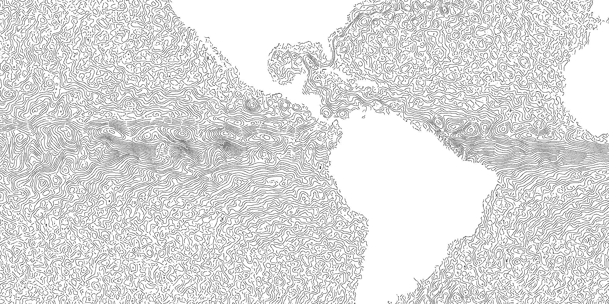

A Rust implementation with Python bindings of the paper [Creating Evenly-Spaced Streamlines of Arbitrary Density](https://link.springer.com/chapter/10.1007/978-3-7091-6876-9_5) by Bruno Jobard and Wilfrid Lefer.